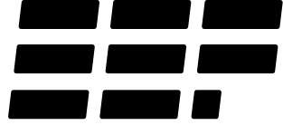

<picture style="margin-right: 15px; float: right;">
  <source
    media="(prefers-color-scheme: dark)"
    srcset="assets/erlef-logo-dark.svg"
    width="170px"
    align="right"
  />
  <source
    media="(prefers-color-scheme: light)"
    srcset="assets/erlef-logo-light.svg"
    width="170px"
    align="right"
  />
  
</picture>

# Erlang Ecosystem Foundation CNA

**Maintaining the CVE Numbering Authority for the Erlang Ecosystem Foundation**

 

---

:warning: **Note: This project is currently under construction and is not yet active.** :warning:

---

This organization handles the CVE Numbering Authority (CNA) for the Erlang Ecosystem Foundation (EEF). This is not the main organization; please visit the main EEF GitHub organization at [`@erlef`](https://github.com/erlef).

This project is maintained by the [Security Working Group](https://erlef.org/wg/security).

<!-- TODO: Put Correct Email -->
To request a CVE, please email [cna@erlef.org](mailto:cna@erlef.org).

<!-- TODO: Put link to policy -->
For our security policy, please refer to our [Security Policy](#).

## Join Us

- **Basic Membership**: Attend meetings, join our Slack workspace, submit news tips.
- **Annual Supporting Membership**: All basic benefits plus voting rights, optional `erlef.org` email.
- **Lifetime Supporting Membership**: All annual benefits at a reduced one-time fee.

[**Learn More and Join**](https://members.erlef.org/join-us)

## Become a Sponsor

Your donation supports the development of technologies and open-source projects used daily by engineers worldwide. Sponsors receive acknowledgment with their logo and link on our website and communications.

[**Become a Sponsor**](https://erlef.org/sponsors#become-a-sponsor)